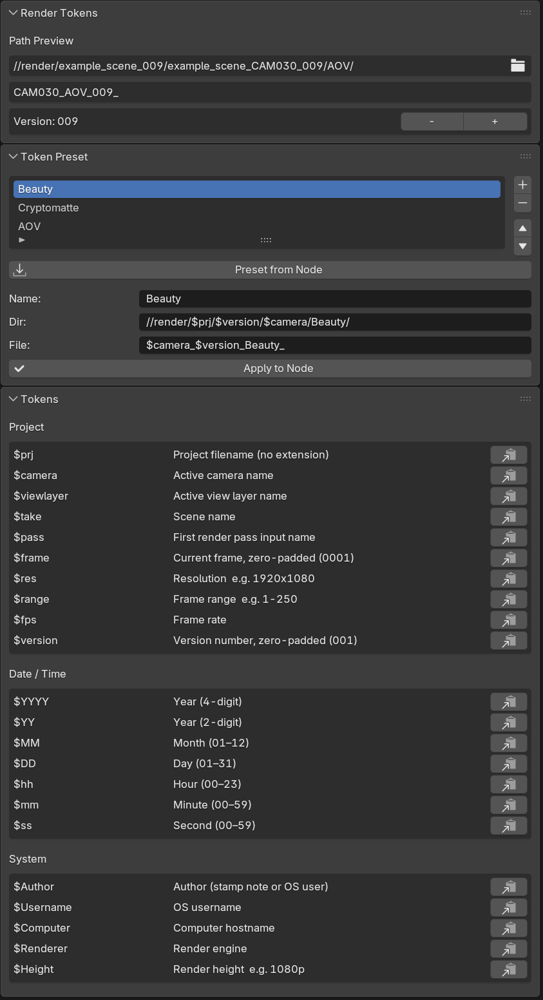
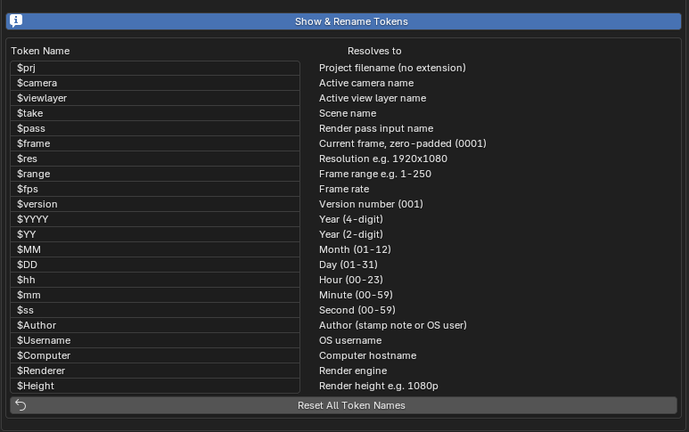

# File Output Render Tokens

A Blender addon that brings a file output token system to **File Output nodes** and the **render filepath**. Set up paths once — tokens resolve automatically at render time.

## Installation

1. Download the latest ZIP from [Releases](https://github.com/NicklasMar/blender-file-output-tokens/releases/latest)
2. Blender → **Edit → Preferences → Add-ons → Install**
3. Select the ZIP and enable **File Output Render Tokens**

**Token Panel** — Path Preview, Version control and Presets directly in the Compositor sidebar.



**Show & Rename Tokens** — Assign custom names to any token for studio pipelines.
Custom token names: **Edit → Preferences → Add-ons → File Output Render Tokens → Show & Rename Tokens**



## Features

- Live **Path Preview** in Compositor sidebar and Output Properties
- **Version control** with one-click increment/decrement
- **Token Presets** for fast node setup (Beauty, Cryptomatte, AOV)
- **Rename any token** to match your studio's naming convention
- Tested in Blender 5.0.0

## Tokens

| Token | Resolves to |
|---|---|
| `$prj` | Project filename (no extension) |
| `$camera` | Active camera name |
| `$viewlayer` | Active view layer name |
| `$take` | Scene name |
| `$pass` | Render pass input name |
| `$frame` | Current frame, zero-padded (0001) |
| `$res` | Resolution e.g. 1920x1080 |
| `$range` | Frame range e.g. 1-250 |
| `$fps` | Frame rate |
| `$version` | Version number, zero-padded (001) |
| `$YYYY` / `$YY` | Year (4- or 2-digit) |
| `$MM` / `$DD` | Month / Day |
| `$hh` / `$mm` / `$ss` | Hour / Minute / Second |
| `$Author` | Stamp note or OS user |
| `$Username` | OS username |
| `$Computer` | Hostname |
| `$Renderer` | Render engine (Cycles, EEVEE) |
| `$Height` | Render height e.g. 1080p |

## Default Presets

| Name | Directory | File |
|---|---|---|
| Beauty | `//Export/$prj/$version/$camera/Beauty/` | `$camera_$version_Beauty_` |
| Cryptomatte | `//Export/$prj/$version/$camera/Cryptomatte/` | `$camera_$version_Cryptomatte_` |
| AOV | `//Export/$prj/$version/$camera/AOV/` | `$camera_$version_$pass_` |

### Folder Structure

The presets produce the following output structure (example with project `myfilm`, version `001`, camera `MAIN`):

```
Export/
└── myfilm/
    └── 001/
        └── MAIN/
            ├── Beauty/
            │   └── MAIN_001_Beauty_0001.exr
            ├── Cryptomatte/
            │   └── MAIN_001_Cryptomatte_0001.exr
            └── AOV/
                └── MAIN_001_Diffuse_0001.exr
```


## Credits

Created and maintained by **Nicklas.mar**.
If you use or build upon this addon, credit is appreciated.

## License

GPL v3 — see [LICENSE](LICENSE). Derivative works must also be released as open source under GPL v3. The copyright notice in the source file must not be removed or altered.
